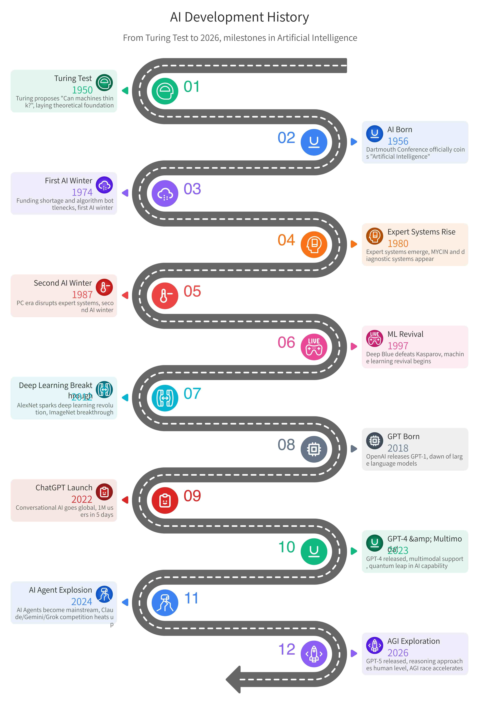
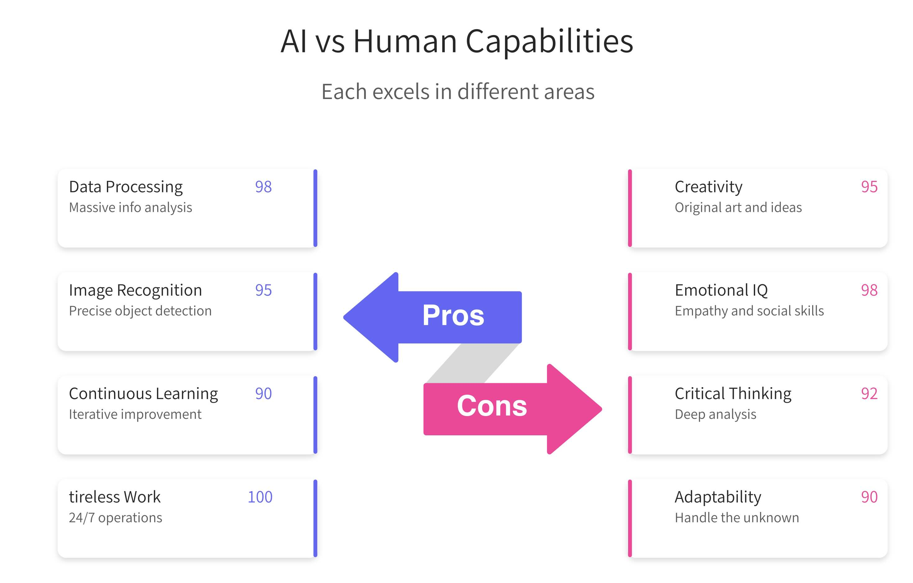
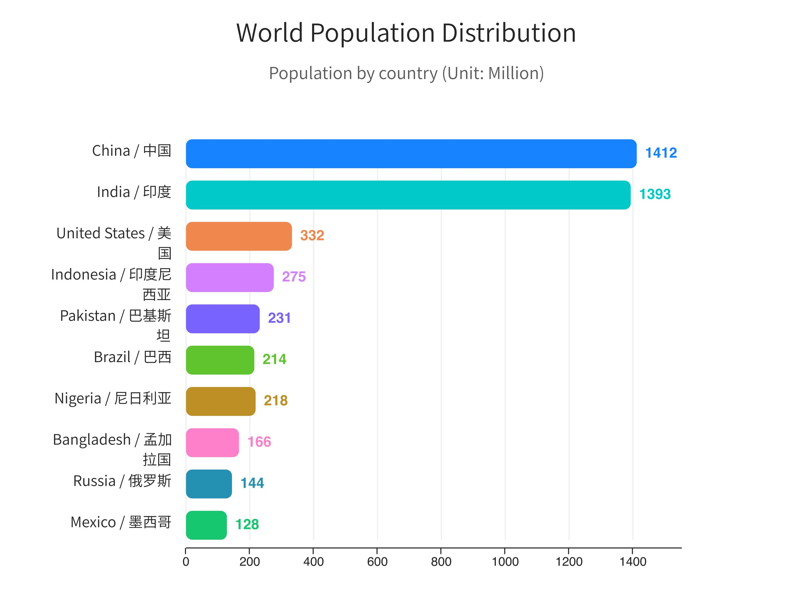

# MindChart

<!-- Language Switcher -->
<div align="center">
  <p>

[](https://github.com/zhangsl/mindchart/blob/main/README.md)
[](https://github.com/zhangsl/mindchart/blob/main/README.zh.md)

  </p>
</div>

---

## ✨ Features

<p>

🎨 **276+ Infographic Templates** — Comprehensive coverage of list, sequence, comparison, hierarchy, relation, and chart types

🌐 **Bilingual Support** — Full English and Chinese language support with automatic text rendering

🤖 **AI-Native Integration** — Designed for OpenClaw, Claude Code, and Cursor agents

📊 **Professional Output** — High DPI PNG export with Chinese font support (Source Han Sans SC)

</p>

---

## 📸 Gallery


*AI History*


*AI vs Human*


*World Population*

---

## 🚀 Quick Start

### Installation

```bash
# Install dependencies
npm install @antv/infographic opentype.js sharp
```

### Generate Infographics

```bash
# Step 1: Convert .ifgc to SVG
node skills/mindchart/scripts/ifgc2svg input.md output.svg

# Step 2: Convert SVG to PNG (300 DPI)
node skills/mindchart/scripts/svg2png output.svg output.png
```

---

## 📖 Usage

As an AI agent skill, simply describe what infographic you need:

```
Create a timeline infographic showing our company's key milestones from 2018 to 2024
```

The agent will automatically select the appropriate template and generate the infographic.

---

## 📁 Project Structure

```
mindchart/
└── skills/mindchart/
    ├── SKILL.md              # Agent skill definition
    ├── scripts/
    │   ├── ifgc2svg.js       # .ifgc → SVG converter
    │   └── svg2png.js        # SVG → PNG converter
    └── templates/            # 276 .ifgc template files
```

---

## 🎯 Template Types

| Category | Templates | Description |
|----------|----------|-------------|
| `list-*` | 45+ | Row, column, grid layouts with icons |
| `sequence-*` | 40+ | Timeline, process, step progression |
| `compare-*` | 55+ | Binary, SWOT, quadrant analysis |
| `hierarchy-*` | 50+ | Tree, mindmap, structure diagrams |
| `relation-*` | 40+ | Node relationships, flow charts |
| `chart-*` | 46+ | Line, bar, column, wordcloud |

---

## 🔧 Syntax Example

```infographic
infographic list-row-horizontal-icon-arrow
data
  title 企业优势
  desc 展示核心竞争优势
  lists
    - label 技术研发
      value 90
      icon star
    - label 市场增长
      value 85
      icon rocket
theme
  palette #3b82f6 #06b6d4 #10b981
```

---

## 📄 License

MIT

---

<p align="center">

Made with ❤️ for AI agents

</p>
