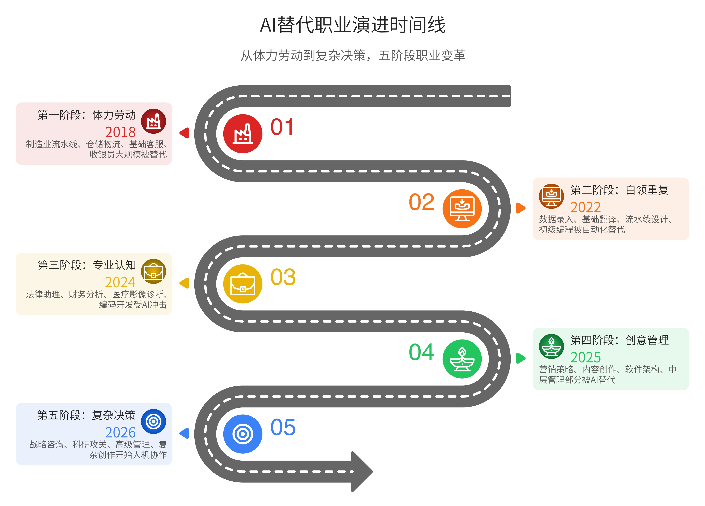
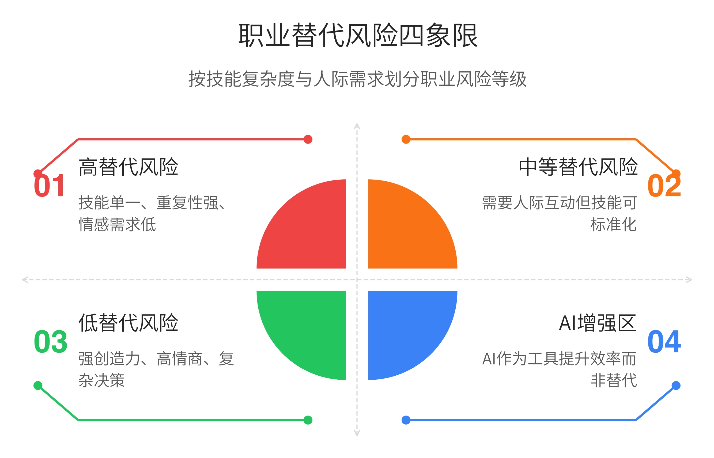
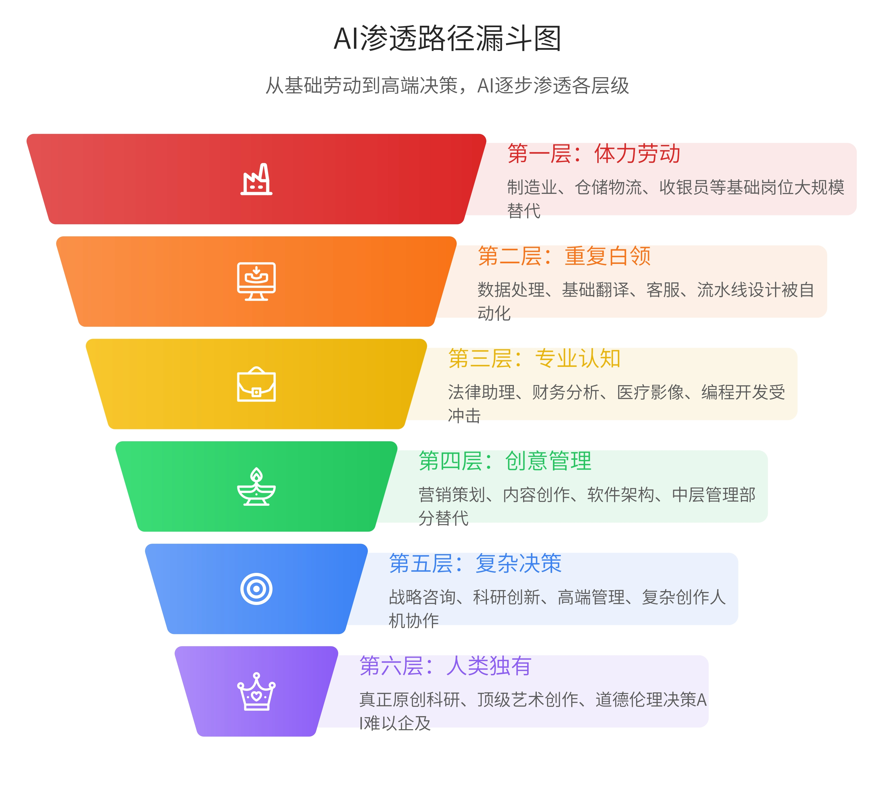
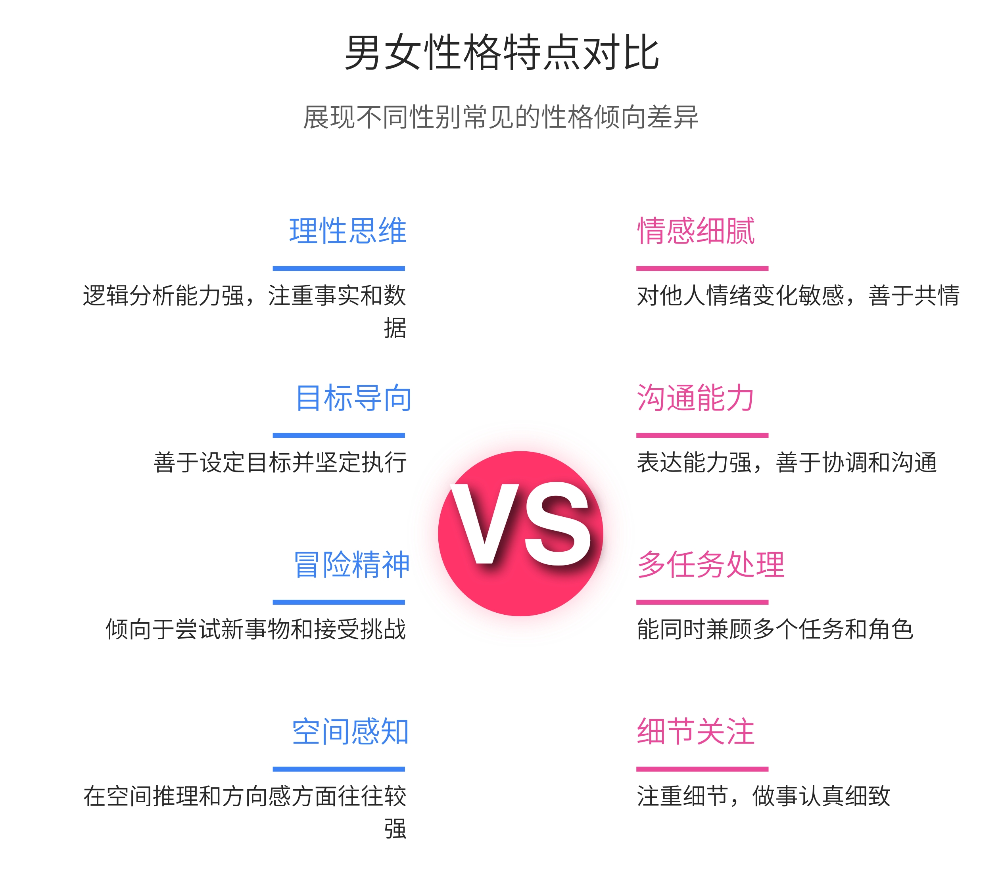
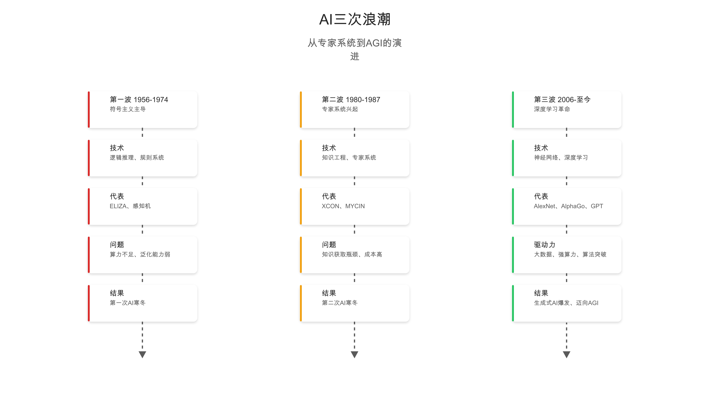
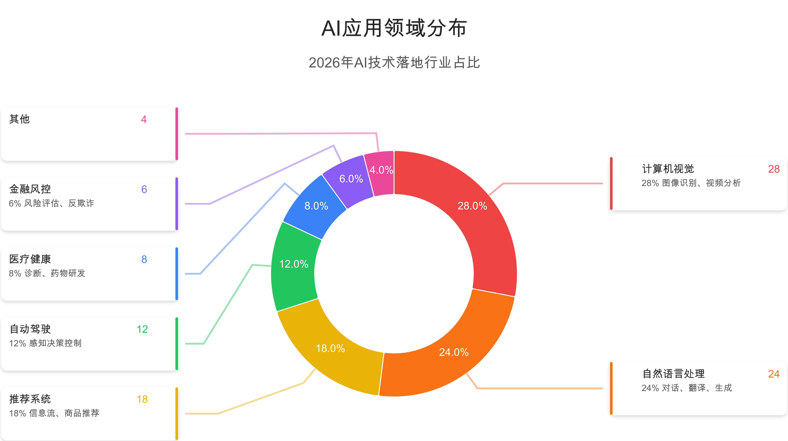
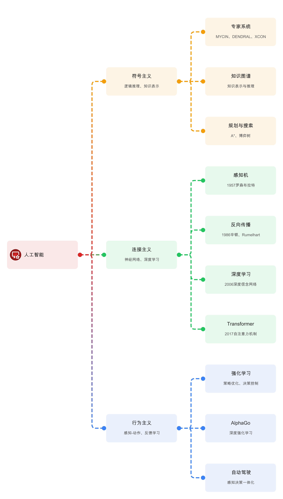
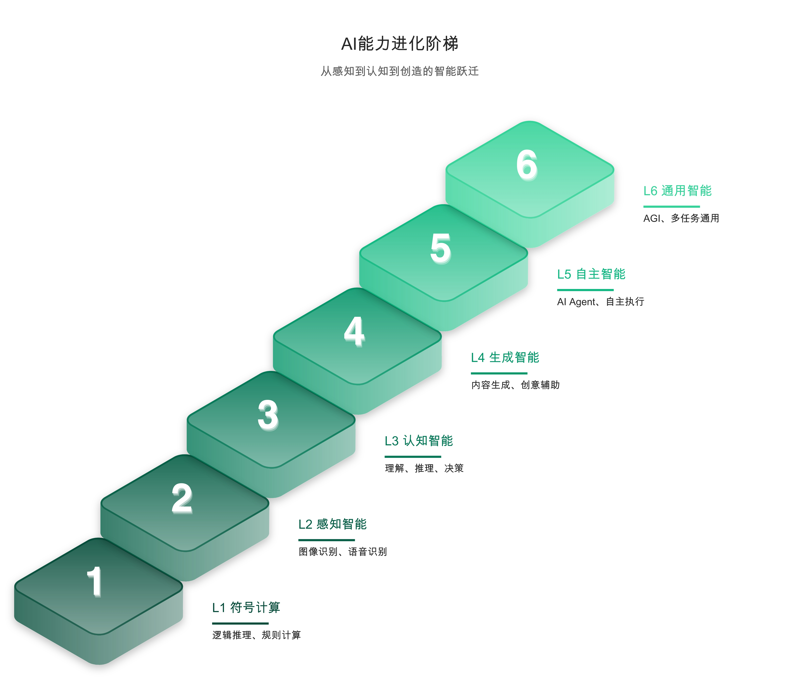
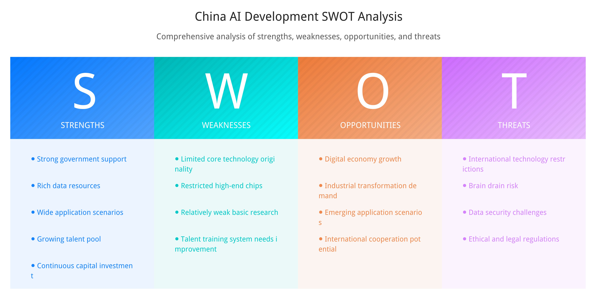
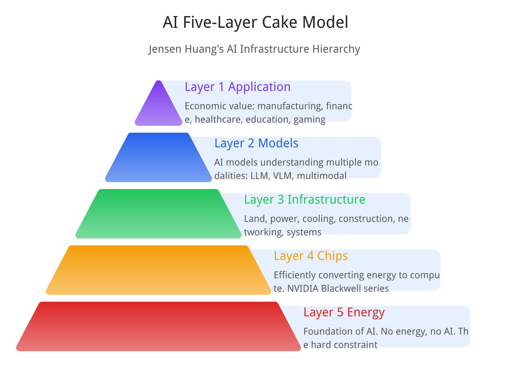

# MindChart

<!-- Badges -->
<div align="center">

[](https://github.com/NewToolAI/mindchart/blob/main/README.md)
[](https://github.com/NewToolAI/mindchart/blob/main/README.zh.md)
[](https://www.npmjs.com/package/@antv/infographic)
[](https://opensource.org/licenses/MIT)
[](https://github.com/NewToolAI/mindchart/stargazers)
[](https://openclaw.ai)

</div>

---

## ✨ 功能特点

<p>

🎨 **276+ 信息图模板** — 涵盖列表、序列、对比、层级、关系、图表等多种类型

🌐 **双语支持** — 完整的中英文支持，自动渲染中文文本

🤖 **AI 原生集成** — 专为 OpenClaw、Claude Code 和 Cursor 智能体设计

📊 **专业输出** — 高清 300 DPI PNG 导出，完整中文思源字体支持

</p>

---

## 📸 作品展示

<p align="center">

</p>
*AI 发展史思维导图*

<p align="center">

</p>
*关系图*

<p align="center">

</p>
*横向列表图标*

<p align="center">

</p>
*纵向卡片列表*

<p align="center">

</p>
*卡片式图表*

<p align="center">

</p>
*三栏布局*

<p align="center">

</p>
*纵向层级图*

<p align="center">

</p>
*纵向层级图 2*

<p align="center">

</p>
*SWOT 四象限*

<p align="center">

</p>
*AI 五层蛋糕模型*

---

## 🚀 快速开始

### 安装依赖

```bash
# 安装依赖
npm install @antv/infographic opentype.js sharp
```

### 生成信息图

```bash
# 步骤 1: 将 .ifgc 转换为 SVG
node skills/mindchart/scripts/ifgc2svg input.md output.svg

# 步骤 2: 将 SVG 转换为 PNG（300 DPI）
node skills/mindchart/scripts/svg2png output.svg output.png
```

---

## 📖 使用方法

作为 AI 智能体技能，只需描述你需要的信息图：

```
创建一张时间线信息图，展示公司从 2018 年到 2024 年的关键里程碑
```

智能体会自动选择合适的模板并生成信息图。

---

## 📁 项目结构

```
mindchart/
└── skills/mindchart/
    ├── SKILL.md              # 智能体技能定义
    ├── scripts/
    │   ├── ifgc2svg.js       # .ifgc → SVG 转换器
    │   └── svg2png.js        # SVG → PNG 转换器
    └── templates/            # 276 个 .ifgc 模板文件
```

---

## 🎯 模板类型

| 类型 | 数量 | 说明 |
|------|------|------|
| `list-*` | 45+ | 横向、纵向、网格布局，带图标 |
| `sequence-*` | 40+ | 时间线、流程、步骤演进 |
| `compare-*` | 55+ | 二元对比、SWOT、四象限分析 |
| `hierarchy-*` | 50+ | 树形、脑图、结构图 |
| `relation-*` | 40+ | 节点关系、流程图 |
| `chart-*` | 46+ | 折线图、柱状图、词云图 |

---

## 🔧 语法示例

```infographic
infographic list-row-horizontal-icon-arrow
data
  title 企业优势
  desc 展示核心竞争优势
  lists
    - label 技术研发
      value 90
      icon star
    - label 市场增长
      value 85
      icon rocket
theme
  palette #3b82f6 #06b6d4 #10b981
```

---

## 📄 开源协议

MIT

---

<p align="center">

Made with ❤️ for AI agents

</p>
